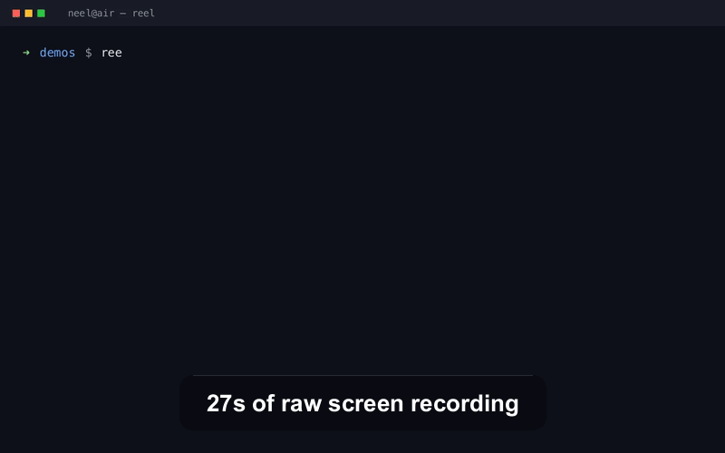

# reel

**Turn raw screen recordings into tight, polished demo GIFs and MP4s.**



## Why

Raw screen recordings are 90% waiting. You hit record, find the window, click
around, wait for a build, read your own output, remember what you meant to
show. A seven-minute capture contains about forty seconds anyone wants to
watch — and nobody on LinkedIn is watching seven minutes of your terminal.

The usual fix is dragging clips around in iMovie for twenty minutes. `reel`
does it from the command line in one pass: it asks ffmpeg where nothing is
moving, builds an edit plan from that, and renders it.

On a real 7m51s QuickTime screen recording from this machine:

```
duration  7:51.1 → 0:34.1
 savings  93% shorter (13.8x)
```

No pip install, no Node, no Electron. Stock Python 3 and ffmpeg.

## 60-second quickstart

```bash
git clone https://github.com/neelbarm/reel && cd reel

# 1. Look at what you recorded.
python3 -m reel inspect ~/Desktop/recording.mov

# 2. Cut it.
python3 -m reel cut ~/Desktop/recording.mov -o demo.gif

# 3. Ship it.
open demo.gif
```

That's it. `reel` runs straight from the repo — nothing to install. If you
want it on your PATH:

```bash
pip install -e .   # optional; gives you a `reel` command
```

Requires **ffmpeg and ffprobe** (`brew install ffmpeg`) and **Python 3.8+**.
Zero Python dependencies, on purpose.

## What it looks like

`reel inspect` prints where the life is:

```
▌reel 0.1.0  │  raw-session.mov
          source  1280x800  h264  30 fps  0:27.6

  ░░░░░░░░░░████████░░░░░░░░░░░░░░░░████████│██████░░░░░░░░░░░░░░░░░░░░░░
  0:00                                                              0:27.6
  █ active   ░ idle / frozen   │ scene cut

Segments
  start    end     len  kind
  00:00  00:03    3.1s  idle
  00:03  00:07    3.7s  active
  00:07  00:12    5.7s  idle
  00:12  00:18    5.4s  active
  00:18  00:28    9.9s  idle

  ● analysis
       runtime  0:27.6
        active  0:09.1  (33%)
          idle  0:18.7  (67%)
       lead-in  0:03.1
      lead-out  0:09.9
    scene cuts  2
```

`reel cut` shows you the plan before it renders it:

```
Edit plan
     in    out     len  speed   → len
  00:03  00:07    3.9s  1x       3.9s
  00:07  00:12    5.7s  8x       0.7s
  00:12  00:18    5.6s  1x       5.6s
  › trimmed 0:02.8 of lead-in
  › trimmed 0:09.6 of lead-out

  ● rendered
    duration  0:27.6 → 0:10.2
     savings  63% shorter (2.7x)
        look  960px wide  12 fps  256 colors
         gif  demo/session.gif  110.7 KB
```

## Example commands

| Command | Before | After |
| --- | --- | --- |
| `reel cut raw.mov -o demo.gif` | 27.6s, 1280x800 | 10.2s GIF, 111 KB |
| `reel cut raw.mov -o demo.gif --cut-idle` | 27.6s | 8.0s GIF |
| `reel cut long.mov -o demo.gif --width 720 --fps 10 --cut-idle` | 7:51.1 | 34.1s GIF, 4.5 MB |
| `reel cut raw.mov -o demo.gif -o demo.mp4` | 27.6s | both, one analysis |

```bash
# Captions, as a bottom banner. Times are output seconds...
reel cut raw.mov -o demo.gif \
  --captions "0-4=Import a folder;4-9=Press Auto-Mix"

# ...or input seconds with `in:`, mapped through the edit for you.
reel cut raw.mov -o demo.gif \
  --captions "in:12.5-18=Auto-Mix picks the crossfades"

# An .srt works too - its times are source times, mapped through the edit
# for you, exactly like `in:`.
reel cut raw.mov -o demo.gif --captions notes.srt

# Crop to just the terminal pane, and preview the result.
reel cut raw.mov -o demo.gif --crop 0:120:1280:700 --preview

# Contact sheet of the scene cuts, for picking a thumbnail.
reel storyboard raw.mov -o sheet.png

# Chapter markers to paste under the post.
reel chapters raw.mov
```

## How it works

**1. Detection — one decode, two signals.** `reel` runs a single ffmpeg pass
whose filterchain is
`scale=320:-2, freezedetect, select='gt(scene,T)', showinfo`. `freezedetect`
writes `freeze_start` / `freeze_end` metadata to stderr whenever consecutive
frames stop differing; the `select`+`showinfo` pair prints a `pts_time` for
every frame that differs *enough* from the last one to count as a cut.
`reel` parses both out of the same stderr. Detection runs at 320px wide
because neither signal cares about the other 95% of the pixels, and a
1080p capture decodes several times faster small.

`freezedetect`'s threshold is a whole-frame mean, so the default
`--freeze-noise 0.0001` is deliberately low: one character appearing in a
terminal changes ~0.02% of a 1280x800 frame, and anything looser reads
typing as dead air.

**2. Planning — pure functions.** `plan.py` turns `(duration, freezes)` into
a contiguous list of segments with speed factors: trim the lead-in and
lead-out (keeping a 0.25s pad so the GIF doesn't start mid-gesture), give
idle stretches over `--idle-min` a `--idle-speed` multiplier or drop them
with `--cut-idle`, leave the rest at 1x, then absorb any sub-`--min-segment`
slivers into their neighbours so a cursor twitch doesn't become its own cut.
No I/O, no ffmpeg — which is why it is tested in milliseconds.

**3. Filtergraph — one string, one invocation.** `graph.py` turns the plan
into a single `-filter_complex`:

```
[0:v]trim=start=2.75:end=7,setpts=PTS-STARTPTS[s0];
[0:v]trim=start=7:end=12,setpts=(PTS-STARTPTS)/8[s1];
[0:v]trim=start=12:end=15.25,setpts=PTS-STARTPTS[s2];
[s0][s1][s2]concat=n=3:v=1:a=0[cat];
[cat]scale=960:-2:flags=lanczos,setsar=1,fps=12[vout]
```

Every segment is a `trim`+`setpts` branch and they meet at one `concat`. No
temp clips, no stitching, no generation loss — the whole edit is one ffmpeg
invocation per pass, with nothing written between them. (A GIF is two passes,
because the palette has to be built before it can be applied; an MP4 is one.)

**4. Palette optimisation.** GIF is 256 colours, and letting ffmpeg pick them
per-frame looks like 1998. `reel` does the standard two-pass instead:
`palettegen=stats_mode=diff` builds one palette weighted toward the pixels
that actually change, then `paletteuse=dither=sierra2_4a:diff_mode=rectangle`
applies it and only rewrites the moving rectangle of each frame. On a
screen recording that is the difference between a 4 MB GIF and an 84 KB one.

**5. Text, without libfreetype.** `drawtext` only exists in ffmpeg builds
linked against libfreetype, and plenty of Homebrew bottles are not — so
`reel` rasterises caption text itself. `textrender.py` is a small TrueType
engine in pure stdlib Python: it parses `cmap`/`glyf`/`loca`/`hmtx`, flattens
the quadratic outlines, fills them with nonzero winding and 4x vertical
antialiasing, and writes an RGBA PNG through `zlib`. ffmpeg then composites it
with `overlay`, which every build has. The side effect is a better banner
than `drawtext` could draw: exact text metrics, real word wrap, and genuinely
rounded corners.

## CLI reference

```
reel inspect INPUT          analyse and print the timeline
reel cut INPUT -o OUT       plan and render the edit
reel storyboard INPUT       contact sheet of keyframes
reel chapters INPUT         scene cuts as "mm:ss - Scene N"
reel preview FILE           write preview.html for a finished GIF/MP4
```

### Global

| Flag | Default | What |
| --- | --- | --- |
| `--threads N` | `2` | ffmpeg threads per pass |
| `--dry-run` | | print the ffmpeg commands, render nothing |
| `--verbose` | | print every ffmpeg command as it runs |
| `--no-color` | | plain output (also honours `NO_COLOR`) |
| `--font PATH` | auto | TTF/TTC for burned-in text |

### Detection (`inspect`, `cut`, `storyboard`, `chapters`)

| Flag | Default | What |
| --- | --- | --- |
| `--scene-threshold T` | `0.28` | scene sensitivity 0..1; lower finds more cuts |
| `--freeze-noise N` | `0.0001` | how still counts as frozen |
| `--freeze-min S` | `0.9` | shortest freeze worth reporting |
| `--detect-width PX` | `320` | detection downscale; `0` for native |

### `cut`

| Flag | Default | What |
| --- | --- | --- |
| `-o, --output PATH` | `<name>.gif` in `.` | repeat for both a `.gif` and a `.mp4` |
| `--idle-min S` | `1.5` | idle stretches at least this long get handled |
| `--idle-speed X` | `8` | speed factor for idle stretches |
| `--cut-idle` | | drop idle stretches entirely |
| `--speed X` | `1` | speed factor for the active parts |
| `--no-trim` | | keep the leading/trailing dead time |
| `--start S` / `--end S` | | force the in/out point (input seconds) |
| `--min-segment S` | `0.30` | absorb kept segments shorter than this |
| `--fps F` | `12` | output frame rate |
| `--width PX` | `960` | output width (rounded down to even) |
| `--crop x:y:w:h` | | crop the source before scaling |
| `--captions SPEC` | | `"0-4=Text;4-9=Next"`, `in:` prefix, or a `.srt` |
| `--colors N` | `256` | GIF palette size |
| `--dither MODE` | `sierra2_4a` | `sierra2_4a`, `floyd_steinberg`, `bayer`, `none` |
| `--bayer-scale N` | `3` | only with `--dither bayer` |
| `--loop N` | `0` | GIF loop count; `0` is forever |
| `--crf N` / `--preset P` | `20` / `veryfast` | H.264 quality for MP4 |
| `--preview` | | also write `preview.html` next to the output |

### `storyboard`

`--every S` (evenly spaced instead of scene cuts), `--max-frames N` (12),
`--cols N` (4), `--thumb-width PX` (420), `-o PATH`.

### `inspect` / `chapters`

Both take `--json` for machine-readable output. `inspect` also takes
`--ascii` for a `#`/`.`/`|` timeline; `chapters` also takes `--plain` for
bare markers with no header.

## Tests

```bash
scripts/make_fixture.sh tests/fixtures/fixture.mov   # optional; tests do it
python3 -m unittest discover -s tests -t .
```

124 tests, ~20 seconds. The pure functions (planner, filtergraph builder,
log parsers, caption grammar, argument validation, output staging, TrueType
rasteriser) run without ffmpeg; the
integration tests build a 17-second synthetic screen recording with
`lavfi` — 3s dead, 4s motion, 5s frozen, 3s of a second scene, 2s dead — and
assert that `inspect` finds the freeze and the cut within 0.5s, that `cut`
produces a GIF meaningfully shorter than the input, and that the filtergraph
builder emits the exact expected string for a known plan.

## Known limits

- `freezedetect` compares whole frames, so a tiny moving element (a spinner
  in one corner, a blinking cursor) can keep a stretch out of "idle". Lower
  `--freeze-noise` or pass `--start`/`--end` by hand.
- Audio is dropped. These are silent demo loops.
- Speed changes are applied with `setpts`, which drops frames rather than
  blending them — deliberate, since 8x idle should look like a fast-forward.
- Analysis is a full decode: roughly 9x realtime on a 1080p60 capture.

---

MIT. Planned by Claude Fable 5.1, built by a Claude Opus agent in one evening
with Claude Code.
